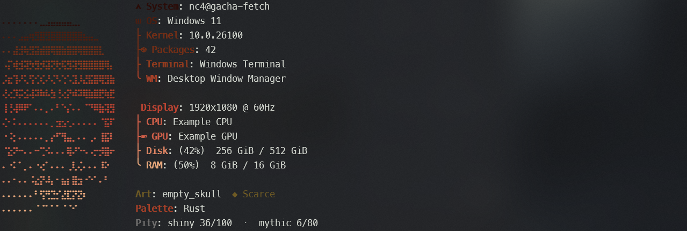
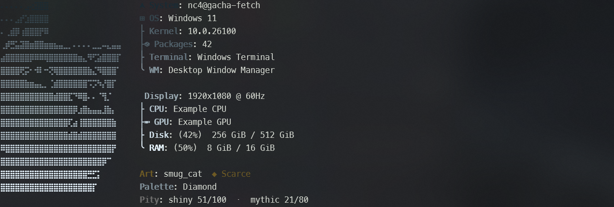
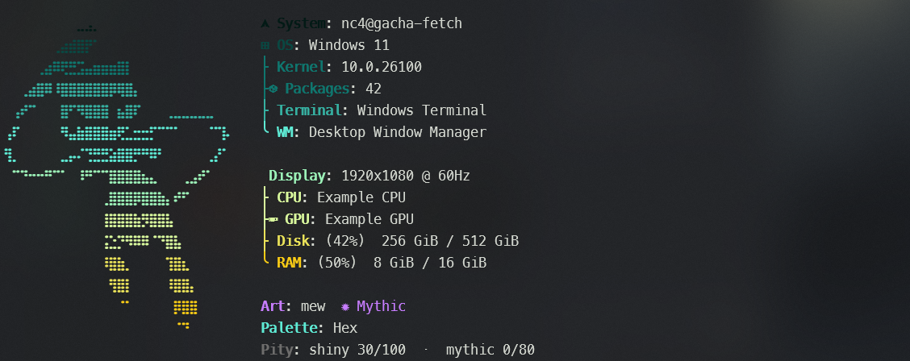
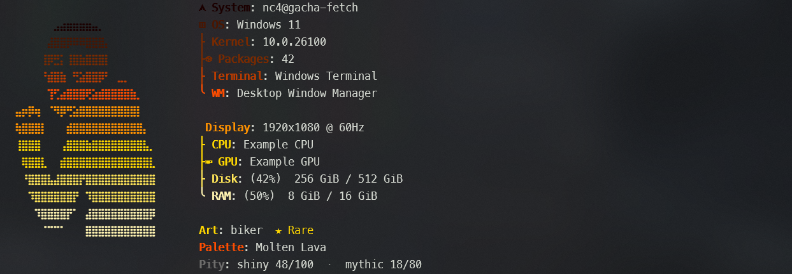
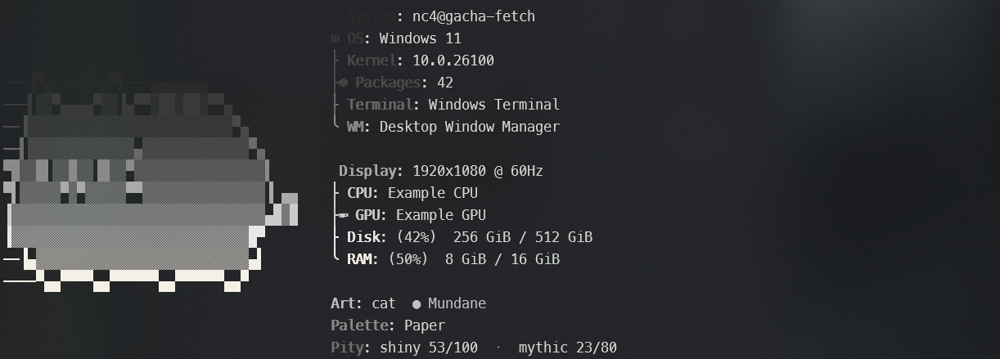
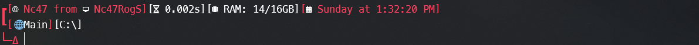
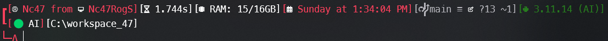
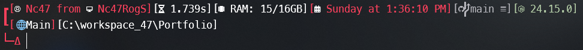

<div align="center">

# nc4-gacha-fetch

A Windows Terminal look that rolls a new ASCII logo every time you open a shell.

[](https://github.com/naifcx47350/nc4-gacha-fetch/actions/workflows/ci.yml)
[](docs/getting-started.md)
[](docs/getting-started.md)
[](LICENSE)

[What it is](#what-it-is) · [Screenshots](#what-it-looks-like) · [Install](#install) · [Try it first](#try-it-without-installing) · [Guides](#guides)

</div>

---

## What it is

Two pieces. You can install **both**, or only the one you want.

| Piece | In plain language |
| --- | --- |
| **Gacha fetch** | A [fastfetch](https://github.com/fastfetch-cli/fastfetch) splash: picture on the left, PC specs on the right. Each new window rolls a rarity, then paints the picture and the colours from **that same rank**. A **1 in 250 shiny** can swap the colours. |
| **Prompt** | The line you type on. An [oh-my-posh](https://ohmyposh.dev/) theme with your name, how long the last command took, RAM, time, git, and a few extras (icons, fuzzy find, aliases). |

You do not need to read the scripts. Follow the five steps, pick a number when asked, open a new tab.

---

## What it looks like

<p align="center">
  
</p>
<p align="center"><em>A fetch roll — art, palette, and pity under the specs.</em></p>

<p align="center">
  
</p>

<details>
<summary>More fetch rolls</summary>

<br>





</details>

<p align="center">
  
</p>
<p align="center"><em>The prompt — what you type on after the fetch.</em></p>

<details>
<summary>More prompt shots</summary>

<br>




</details>

---

## Install

Five steps, in order. Everything is typed into a **PowerShell 7** tab.

**You will need** Windows 10 or 11, Windows Terminal, PowerShell 7, and a Nerd Font. If any of that is new to you, [getting started](docs/getting-started.md) explains each one in everyday language — then come back here.

> [!IMPORTANT]
> **PowerShell 7** and **Windows PowerShell** are two different apps. You want the one simply called *PowerShell*. Check with `$PSVersionTable.PSVersion` — the first number should be 7.

> [!NOTE]
> **Nothing is replaced without a backup.** Only PowerShell 7's own startup file is touched — Windows PowerShell 5.1, conda, your modules, and an oh-my-posh theme you already have are all left alone, and your gacha pity survives reinstalls. Full list: [what the installer touches](docs/getting-started.md#what-the-installer-will-and-will-not-touch).

### Step 1 — Allow the script to run

Windows blocks downloaded scripts by default. This allows them **for your user account only**:

```powershell
Set-ExecutionPolicy -Scope CurrentUser RemoteSigned
```

### Step 2 — Download the project

```powershell
git clone https://github.com/naifcx47350/nc4-gacha-fetch.git
cd nc4-gacha-fetch
```

No Git? Click the green **Code** button at the top of this repo → **Download ZIP**, unzip it, then `cd` into that folder. If you would rather install Git first, [getting started has the download link](docs/getting-started.md#git-or-a-zip).

### Step 3 — Choose what you want, and run it

Remember the two pieces: the **fetch** is the picture drawn once when a tab opens, the **prompt** is the coloured line you type on all session. Neither needs the other.

Pick one of these three and run it. Nothing else in this step.

> [!TIP]
> **Not sure? Pick 1.** It's what the screenshots show, and you can switch later by running the installer again with a different number.

#### 1 — Both

```powershell
./install.ps1 1 -InstallModules -InstallTools
```

A logo rolls when you open a tab, and the coloured prompt is there while you work. Replaces whatever startup screen and prompt you have now.

Best if you don't already have a terminal setup you're attached to. → [details](powershell/all/README.md)

#### 2 — Prompt only

```powershell
./install.ps1 2 -InstallModules -InstallTools
```

The coloured line with git branch, timing, RAM and the rest. **No logo rolls** — whatever appears when you open a tab today keeps appearing, including nothing at all.

Best if you like your current startup screen, or don't want a picture every time. → [details](powershell/prompt/README.md)

#### 3 — Fetch only

```powershell
./install.ps1 3 -InstallTools
```

The rolling logo and specs, plus the `reroll` command. **Your prompt is left exactly as it is** — if you've already themed it, that work is safe.

Best if you came here for the gacha and nothing else. → [details](powershell/fetch/README.md)

The installer prints what it does as it goes. Wait for `Done.`

<details>
<summary><strong>What are those extra words on the command?</strong></summary>

<br>

Both are optional. They only save you from installing things by hand first.

| Flag | What it does | Leave it off when |
| --- | --- | --- |
| `-InstallTools` | Downloads the programs that option needs — [oh-my-posh](https://ohmyposh.dev/) for the prompt, [fastfetch](https://github.com/fastfetch-cli/fastfetch) for the logo | You already have them |
| `-InstallModules` | Downloads the four prompt add-ons: `posh-git`, `Terminal-Icons`, `PSFzf`, `z` | You already have them, or you chose option 3, which doesn't use them |

Both use `winget`, which ships with Windows 10 and 11. If it's missing the installer says so and carries on — see [getting started](docs/getting-started.md#tools-the-installer-can-fetch-for-you).

Add **`-WhatIf`** to any of the three commands to print every change it *would* make without touching a single file:

```powershell
./install.ps1 1 -WhatIf
```

If you'd rather type words than numbers, `1` / `All` / `Both`, `2` / `Prompt`, and `3` / `Fetch` / `Gacha` mean the same thing.

</details>

### Step 4 — Point Windows Terminal at the font

Settings (`Ctrl+,`) → **Defaults** (or your PowerShell profile) → **Appearance** → Font face → `MesloLGL Nerd Font Mono`.

Optional: the [terminal snippet](terminal/README.md) also copies the screenshot colours and transparency.

### Step 5 — Open a new tab

Close the old one. A **new** PowerShell 7 tab loads the new startup file.

> [!TIP]
> You should see a picture and specs (options 1 and 3) and a coloured prompt (options 1 and 2). Type `reroll` for another logo right away.

If that is not what you see, open [troubleshooting](docs/troubleshooting.md).

---

## Try it without installing

Rather look before changing anything? Do steps 1 and 2 above, then run this instead of step 3:

```powershell
.\test-shell.ps1
```

That opens a throwaway window using this folder. Your everyday PowerShell profile is **not** replaced. Specs shown are dummy numbers, the same ones in the screenshots — add `-Live` for your real hardware.

Walk every colour set or every logo, still without installing:

```powershell
.\test\preview-palettes.ps1
.\test\preview-arts.ps1
```

Details: [test profile](powershell/test/README.md) · [preview scripts](test/README.md)

---

## After you install

| You installed… | What to expect |
| --- | --- |
| **1 — both** | Logo + specs, then the fancy prompt. `reroll` works. |
| **2 — prompt** | Fancy prompt only. No logo, no `reroll`. |
| **3 — fetch** | Logo + specs. Your old prompt stays. `reroll` works. |

The fetch does not run inside VS Code, Cursor, or JetBrains terminals, so those stay quiet.

Ranks, pity, and the colour lists: **[How the gacha works](docs/gacha.md)**

Add art, add a palette, or edit the prompt: **[Customize](docs/customize.md)**

Planning to add a lot of your own art? `./install.ps1 1 -Link` runs the fetch straight from your clone, so new art shows up without reinstalling. [More on that](docs/customize.md#working-on-art-without-reinstalling).

---

## Guides

The landing page stops here on purpose. Longer pages live next to the files they describe, or under `docs/`.

| Page | When to open it |
| --- | --- |
| [docs/](docs/README.md) | Index of every guide |
| [Getting started](docs/getting-started.md) | Font, PowerShell 7, what is safe |
| [How the gacha works](docs/gacha.md) | Ranks, palettes, pity, `reroll` |
| [Customize](docs/customize.md) | Your own art and colours |
| [Troubleshooting](docs/troubleshooting.md) | Boxes, wrong app, how to undo |
| [powershell/](powershell/README.md) | Map of the four startup files |
| [fastfetch/](fastfetch/README.md) | Art folders and the roll script |
| [CHANGELOG](CHANGELOG.md) | What changed between versions |
| [CONTRIBUTING](CONTRIBUTING.md) | Reporting a problem, and why art PRs are closed |

```
nc4-gacha-fetch/
├─ install.ps1                 # 1 both · 2 prompt · 3 fetch
├─ powershell/
│  ├─ all/                     # option 1
│  ├─ prompt/                  # option 2 (+ themes/)
│  ├─ fetch/                   # option 3
│  ├─ test/                    # test-shell.ps1
│  └─ profile.ps1              # optional conda snippet
├─ fastfetch/                  # art, templates, roll script
├─ test/                       # palette and art previews
├─ terminal/                   # optional window colours
└─ docs/
```

Some ASCII art is fan-made and the collection is curated by hand, so art pull requests are closed — see [CONTRIBUTING](CONTRIBUTING.md). Bug reports and doc fixes are very welcome.

---

## Credits

- [fastfetch](https://github.com/fastfetch-cli/fastfetch)
- Layout inspired by [FastCat](https://github.com/m3tozz/FastCat)
- [oh-my-posh](https://ohmyposh.dev/)
- Gacha idea inspired by [routefetch](https://github.com/TitaniteScale/routefetch)

Some ASCII pieces are fan-made likenesses (games, memes). They are included for personal terminal use, not as original commercial art.

## License

[MIT](LICENSE)
